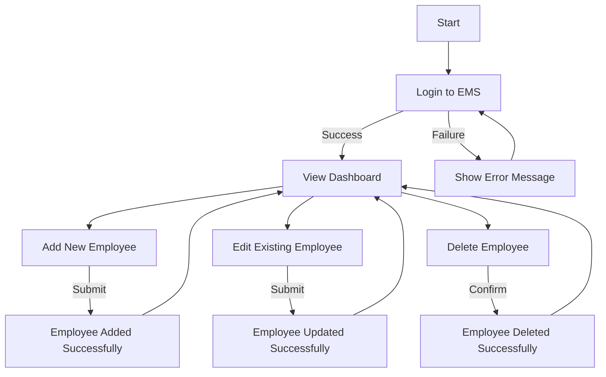
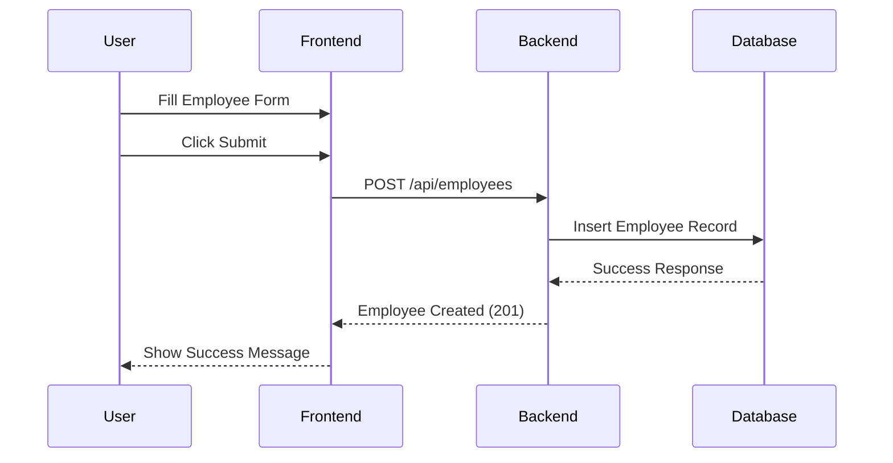

# Employee Management System (EMS)

## Overview
This project is an Employee Management System built with Node.js, Express.js, Sequelize, and MySQL for the backend, and plain HTML/JavaScript for the frontend.

---

## Features
- Backend CRUD API for managing employees.
- Frontend interface for interacting with the API.
- Responsive design for desktop and mobile.
- Unit tests for backend functions.

---

## Setup Instructions

### Prerequisites
- Node.js installed on your system.
- MySQL database setup.

### Installation
1. Clone the repository:
   ```bash
   git clone <repository-url>
   ```
2. Navigate to the project directory:
   ```bash
   cd ems
   ```
3. Install dependencies:
   ```bash
   npm install
   ```

---

## Running the Application

### Backend
1. Start the backend server:
   ```bash
   node server.js
   ```

### Frontend
1. Open `index.html` in your browser.

---

## Running Unit Tests
1. Run the following command to execute the unit tests:
   ```bash
   npm test
   ```
2. The tests will validate the backend functions and provide a report.

---

## Testing Libraries Used
- **Jest**: For running unit tests.
- **Supertest**: For testing HTTP endpoints.
- **Sequelize Mock**: For mocking Sequelize models.

---

## Application Documentation

## User Flow
The following flowchart illustrates the user journey in the EMS application:



## Sequence Diagram
The following sequence diagram shows the interaction between the user, frontend, and backend during an employee creation process:



---

## How It Works
1. **Frontend**:
   - The user interacts with the application through the `index.html` file.
   - JavaScript handles CRUD operations by making HTTP requests to the backend API.

2. **Backend**:
   - The backend is built with Node.js and Express.js.
   - It provides RESTful API endpoints for managing employees.
   - Sequelize is used to interact with the MySQL database.

3. **Database**:
   - The MySQL database stores employee data.
   - Sequelize models define the structure and constraints of the data.

---

By following the user flow and sequence diagram, you can understand how the EMS application processes user actions and manages data.

---

## Contribution
Feel free to fork the repository and submit pull requests for improvements.