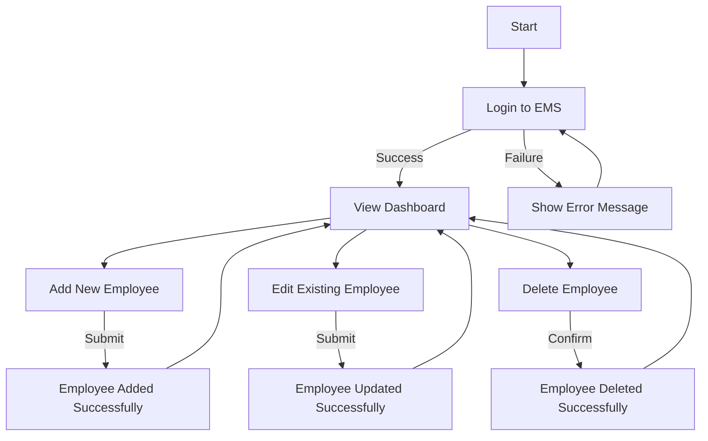
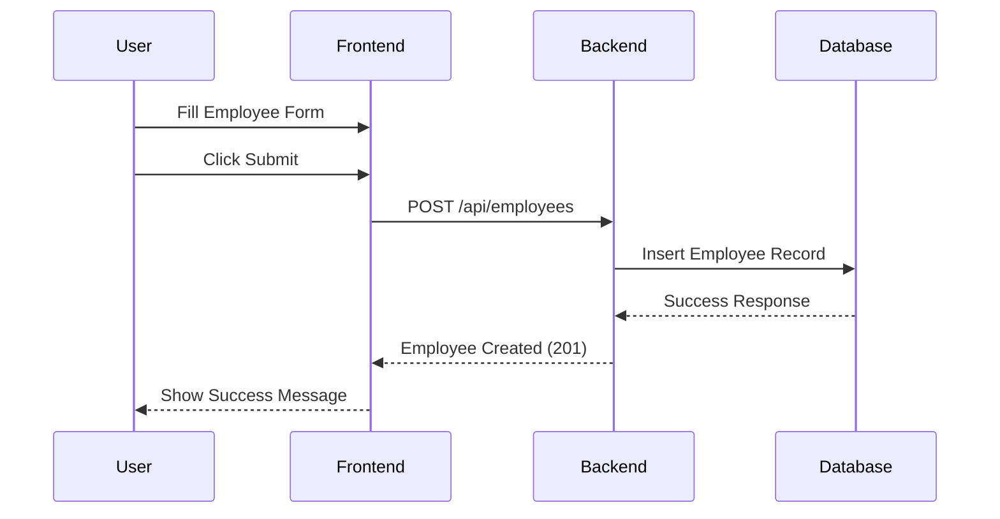

# Application Documentation

## Overview
This section provides a detailed explanation of how the Employee Management System (EMS) works, including user flows and backend processes.

---

## User Flow
The following flowchart illustrates the user journey in the EMS application:

---

## Sequence Diagram
The following sequence diagram shows the interaction between the user, frontend, and backend during an employee creation process:

---

## How It Works
1. **Frontend**:
   - The user interacts with the application through the `index.html` file.
   - JavaScript handles CRUD operations by making HTTP requests to the backend API.

2. **Backend**:
   - The backend is built with Node.js and Express.js.
   - It provides RESTful API endpoints for managing employees.
   - Sequelize is used to interact with the MySQL database.

3. **Database**:
   - The MySQL database stores employee data.
   - Sequelize models define the structure and constraints of the data.

---

By following the user flow and sequence diagram, you can understand how the EMS application processes user actions and manages data.